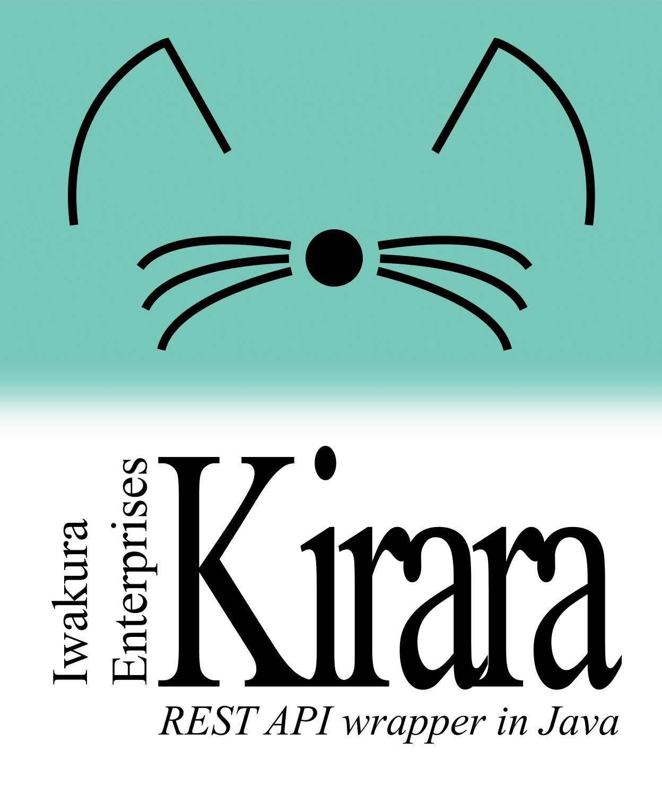

# Kirara

Powerful yet simple RESTful API wrapper library for Java. Worry not about wrapping any RESTful API
with boilerplate code, with guidance Kirara will do it for you.

> Disclaimer: The library name is not related to any character in any game or media.

## Project structure
- `kirara-core`: The core library that provides the RESTful API wrapping functionality.
- `kirara-gson`: Implementation of Kirara's `Serializer` using [Gson](https://github.com/google/gson).
- `kirara-httpclient`: Implementation of Kirara's `HttpCore` using Java 11's `HttpClient`.

More modules may be added in the future, such as `kirara-jackson`.

## Documentation

Documentation is available at the [Central iwakura.enterprises documentations](https://docs.iwakura.enterprises/kirara.html)
